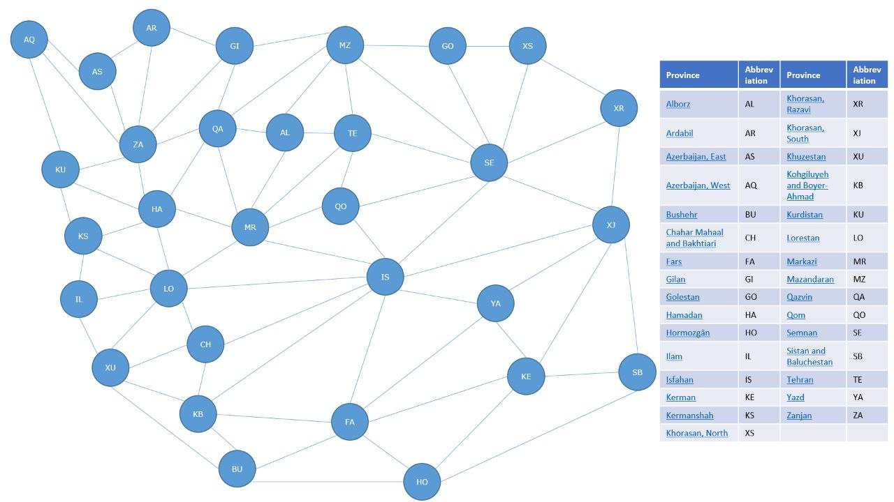

# Map Coloring Problem Solver
### Introduction
This Python script is designed to solve the classic map coloring problem using a backtracking algorithm. The map coloring problem is a classic problem in graph theory and computer science, which asks whether it is possible to color a map using a limited number of colors such that no two adjacent regions have the same color.
### Usage
1. Input Files:
    - Ensure you have the map data files (map-iran.txt and map-khorasan.txt) in the same directory as the script. These files contain the adjacency information for the regions of Iran and Khorasan, Iran respectively.
2. Running the Script:
    - Run the main.py script using Python 3.
3. Output:
    - The script print the color assignments for each region.

### Map Visualization
Below are visual representations of the maps used in the script:
### 1. Iran Map:

### 2. Khorasan, Iran Map:

### About the Maps
The map data files (map-iran.txt and map-khorasan.txt) contain adjacency information for the regions of Iran and Khorasan, Iran respectively. Each line in the files represents a region, with the adjacent regions listed. The script utilizes this data to solve the map coloring problem for the respective maps.
